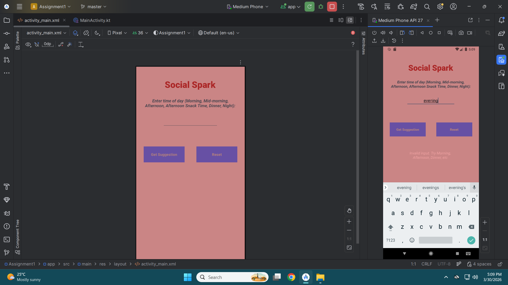

Social Spark App

Purpose:

The Social Spark App helps users maintain social connections by suggesting simple actions based on the time of day.

Features:
- Input time of day (Morning, Afternoon, Dinner, etc.)
- Displays social suggestions
- Reset button to clear input
- Error handling for invalid input

Main Screen

Suggestion Screen

Error Screen

The app was designed to be simple and user-friendly. Clear instructions are provided to guide the user on what to input. The interface is clean and easy to navigate. The app successfully provides social interaction suggestions based on user input and demonstrates the use of Kotlin, GitHub, and automation tools.
