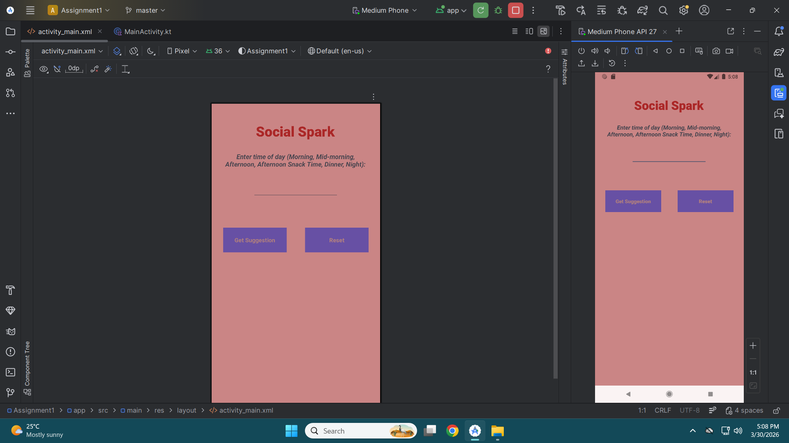

Social Spark App

Purpose:

The Social Spark App helps users maintain their social relationships by suggesting simple actions based on the time of day.

Features:
- Input time of day (Morning, Afternoon, Dinner, etc.)
- Displays social suggestions
- Reset button to clear input
- Error handling for invalid input

Main Screen

Suggestion Screen

Error Screen

The app was designed to be simple and user-friendly. Instructions are provided to guide the user on what to input. The interface is clean and easy to navigate. The app gives suggestions based on user input and shows the use of Kotlin and Github

All the progress and changes made were documented on Github using commits. To build the app automatically, Github Actions was used as changes were made and pushed. Testing was also done manually to ensure suggestions, error messages and clearing user input were working correctly.

Here is a link to a video showcasing how the app works:
